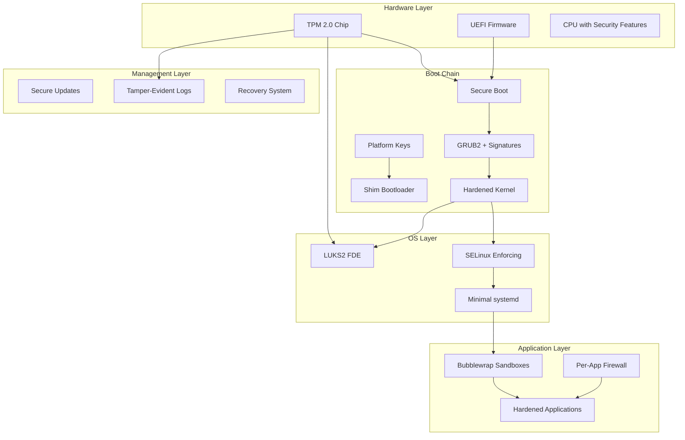
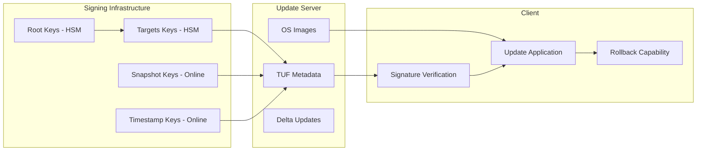

# Design Document: Hardened Laptop Operating System

## Overview

This design document outlines the architecture for a production-grade hardened laptop operating system based on Debian stable, incorporating GrapheneOS-level security principles. The system implements defense-in-depth through hardware-backed security (TPM2, UEFI Secure Boot), kernel hardening, mandatory access controls, application sandboxing, and comprehensive supply chain security.

### Key Design Principles

- **Hardware Root of Trust**: TPM2 and UEFI Secure Boot provide cryptographic foundation
- **Measured Security**: All boot components measured and verified
- **Principle of Least Privilege**: Minimal permissions and attack surface
- **Defense in Depth**: Multiple independent security layers
- **Reproducible Security**: Verifiable builds and transparent supply chain
- **Usable Security**: Security that doesn't impede legitimate use

## Architecture

### System Architecture Overview



### Security Boundaries

1. **Hardware Boundary**: TPM2 provides hardware root of trust
2. **Boot Boundary**: UEFI Secure Boot validates boot chain integrity  
3. **Kernel Boundary**: Hardened kernel with KSPP mitigations
4. **Process Boundary**: SELinux mandatory access control
5. **Application Boundary**: Sandboxed applications with network controls
6. **Network Boundary**: Per-application firewall rules

## Components and Interfaces

### 1. Boot Security Stack

#### UEFI Secure Boot Implementation
- **Custom Platform Keys (PK)**: Root signing authority, user-enrollable
- **Key Exchange Keys (KEK)**: Intermediate signing keys for bootloader updates
- **Database Keys (DB)**: Application signing keys for kernel/drivers
- **Forbidden Database (DBX)**: Revoked key storage

**Key Management Interface**:
```bash
# Key generation and enrollment
sbctl create-keys
sbctl enroll-keys --microsoft  # Optional: keep MS keys for hardware compatibility
sbctl sign-all                 # Sign bootloader and kernel
```

#### Measured Boot Chain
- **PCR 0-7**: UEFI firmware measurements
- **PCR 8-9**: Bootloader measurements  
- **PCR 10-11**: Kernel and initramfs measurements
- **PCR 12-15**: Application and configuration measurements

**TPM2 Sealing Interface**:
```bash
# Seal LUKS key to PCR values
tpm2_createpolicy --policy-pcr -l sha256:0,2,4,7 -f pcr.policy
tpm2_create --parent-auth owner --policy pcr.policy --key-auth keyauth --public key.pub --private key.priv
systemd-cryptenroll --tpm2-device=auto --tpm2-pcrs=0+2+4+7 /dev/sda2
```

### 2. Disk Encryption Architecture

#### LUKS2 Configuration
- **Key Derivation**: Argon2id with 1GB memory, 4 iterations minimum
- **Encryption**: AES-256-XTS with hardware acceleration where available
- **Multiple Keyslots**: 
  - Slot 0: User passphrase (always available)
  - Slot 1: TPM2-sealed key (PCR-bound)
  - Slot 2: Recovery key (offline storage)

**Partition Layout**:
```
/dev/sda1  512MB  EFI System Partition (FAT32, unencrypted)
/dev/sda2  Rest   LUKS2 encrypted (contains LVM)
  └─ /dev/mapper/root-lv     Root filesystem (ext4)
  └─ /dev/mapper/swap-lv     Encrypted swap
```

### 3. Hardened Kernel Configuration

#### KSPP-Aligned Security Features
```bash
# Core hardening options
CONFIG_SECURITY_DMESG_RESTRICT=y
CONFIG_SECURITY_KEXEC_VERIFY_SIG=y
CONFIG_SECURITY_LOCKDOWN_LSM=y
CONFIG_SECURITY_LOCKDOWN_LSM_EARLY=y
CONFIG_LOCK_DOWN_KERNEL_FORCE_CONFIDENTIALITY=y

# Memory protection
CONFIG_VMAP_STACK=y
CONFIG_THREAD_INFO_IN_TASK=y
CONFIG_RANDOMIZE_BASE=y
CONFIG_RANDOMIZE_MEMORY=y
CONFIG_LEGACY_VSYSCALL_NONE=y

# Attack surface reduction
CONFIG_DEVMEM=n
CONFIG_DEVKMEM=n
CONFIG_PROC_KCORE=n
CONFIG_COMPAT_VDSO=n
CONFIG_X86_VSYSCALL_EMULATION=n

# Exploit mitigations
CONFIG_HARDENED_USERCOPY=y
CONFIG_FORTIFY_SOURCE=y
CONFIG_STACKPROTECTOR_STRONG=y
CONFIG_SLAB_FREELIST_RANDOM=y
CONFIG_SLAB_FREELIST_HARDENED=y
```

#### Compiler Hardening
```makefile
# Kernel build flags
KBUILD_CFLAGS += -fstack-protector-strong
KBUILD_CFLAGS += -fstack-clash-protection  
KBUILD_CFLAGS += -fcf-protection=full
KBUILD_CFLAGS += -fzero-call-used-regs=used-gpr
```

### 4. Mandatory Access Control (SELinux)

#### Policy Architecture
- **Base Policy**: Debian's targeted policy as foundation
- **Custom Domains**: Application-specific confinement
- **Network Controls**: Integration with nftables for per-process rules

**Key SELinux Domains**:
```
# Core system domains
kernel_t          # Kernel threads
init_t            # systemd init process  
unconfined_t      # Administrative access (minimal use)

# Application domains  
browser_t         # Web browsers (strict confinement)
office_t          # Office applications
media_t           # Media players/editors
dev_t             # Development tools
```

**SELinux-nftables Integration**:
```bash
# Per-process network rules via SELinux labels
nft add rule inet filter output meta skuid browser_t tcp dport { 80, 443 } accept
nft add rule inet filter output meta skuid office_t drop
```

### 5. Application Sandboxing Framework

#### Bubblewrap Sandbox Profiles

**Browser Sandbox Profile**:
```bash
#!/bin/bash
# Browser sandbox with minimal filesystem access
bwrap \
  --ro-bind /usr /usr \
  --ro-bind /lib /lib \
  --ro-bind /lib64 /lib64 \
  --tmpfs /tmp \
  --tmpfs /var/tmp \
  --proc /proc \
  --dev /dev \
  --tmpfs /home \
  --bind ~/.config/browser ~/.config/browser \
  --bind ~/Downloads ~/Downloads \
  --unshare-all \
  --share-net \
  --die-with-parent \
  --new-session \
  "$@"
```

**Office Application Profile**:
```bash
#!/bin/bash  
# Office apps with document access but no network
bwrap \
  --ro-bind /usr /usr \
  --ro-bind /lib /lib \
  --tmpfs /tmp \
  --proc /proc \
  --dev /dev \
  --bind ~/Documents ~/Documents \
  --bind ~/.config/office ~/.config/office \
  --unshare-all \
  --unshare-net \
  --die-with-parent \
  "$@"
```

### 6. Network Security Architecture

#### Per-Application Firewall (nftables)
```bash
# Default deny policy
nft add table inet filter
nft add chain inet filter input { type filter hook input priority 0; policy drop; }
nft add chain inet filter output { type filter hook output priority 0; policy drop; }

# Per-application rules based on systemd service or SELinux context
nft add rule inet filter output meta skuid browser_t tcp dport { 80, 443 } accept
nft add rule inet filter output meta skuid update_t tcp dport 443 accept
nft add rule inet filter output meta skuid ssh_t tcp dport 22 accept
```

#### DNS Security
```bash
# DNS over TLS configuration (systemd-resolved)
[Resolve]
DNS=1.1.1.1#cloudflare-dns.com 8.8.8.8#dns.google
DNSOverTLS=yes
DNSSEC=yes
FallbackDNS=
```

### 7. Secure Update System

#### TUF-Based Update Architecture


**Update Client Interface**:
```bash
# Update process with signature verification
hardened-update check                    # Check for updates
hardened-update download --verify        # Download and verify signatures
hardened-update apply --staged           # Stage update for next boot
hardened-update rollback                 # Rollback to previous version
```

### 8. Logging and Audit System

#### Tamper-Evident Logging
```bash
# Structured logging with cryptographic integrity
journald-sign --key /etc/systemd/journal-sign.key
systemctl enable systemd-journal-remote
systemctl enable systemd-journal-upload
```

**Log Forwarding Configuration**:
```ini
# /etc/systemd/journal-upload.conf
[Upload]
URL=https://log-server.example.com/upload
ServerKeyFile=/etc/ssl/private/journal-upload.key
ServerCertificateFile=/etc/ssl/certs/journal-upload.crt
TrustedCertificateFile=/etc/ssl/certs/log-server-ca.crt
```

## Data Models

### Security Configuration Schema

```yaml
# /etc/hardened-os/security-config.yaml
security_policy:
  selinux:
    mode: enforcing
    policy: targeted
    custom_domains:
      - browser_t
      - office_t
      - media_t
  
  sandboxing:
    default_profile: strict
    profiles:
      browser:
        filesystem: minimal
        network: restricted
        devices: minimal
      office:
        filesystem: documents_only
        network: none
        devices: minimal
  
  firewall:
    default_policy: drop
    per_app_rules: true
    logging: enabled
  
  updates:
    auto_check: true
    auto_download: true
    auto_apply: false
    rollback_limit: 3
```

### TPM2 Key Management Schema

```yaml
# /etc/hardened-os/tpm-config.yaml
tpm2:
  pcr_policy:
    luks_unsealing: [0, 2, 4, 7]
    attestation: [0, 1, 2, 3, 4, 5, 6, 7]
  
  key_hierarchy:
    storage_root_key:
      algorithm: rsa2048
      attributes: [restricted, decrypt, sign]
    
    luks_key:
      parent: storage_root_key
      policy: pcr_policy.luks_unsealing
      
    attestation_key:
      parent: storage_root_key  
      policy: pcr_policy.attestation
```

## Error Handling

### Boot Failure Recovery

1. **TPM Unsealing Failure**:
   - Fallback to passphrase entry
   - Log PCR mismatch details
   - Offer TPM reset and re-sealing

2. **Secure Boot Failure**:
   - Boot to recovery mode with signed recovery kernel
   - Allow key re-enrollment
   - Maintain audit log of boot failures

3. **Kernel Panic/Corruption**:
   - Automatic rollback to previous kernel
   - Boot parameter modification via recovery console
   - Remote attestation of recovery state

### Runtime Security Violations

```bash
# SELinux denial handling
ausearch -m avc -ts recent | audit2allow -M local_policy
semodule -i local_policy.pp  # Only after security review

# Sandbox escape detection
systemctl --user restart app-sandbox@browser.service
journalctl -u app-sandbox@browser.service --since "1 hour ago"

# Network policy violations  
nft monitor trace | grep "policy violation"
systemctl restart nftables-per-app.service
```

## Testing Strategy

### Security Testing Framework

#### 1. Boot Security Tests
```bash
# Verify Secure Boot chain
sbctl verify                           # Check signature validity
tpm2_pcrread                          # Verify PCR measurements
efibootmgr -v                         # Check boot order and signatures

# Test TPM sealing/unsealing
tpm2_unseal --object-context sealed.ctx --auth session:session.ctx
cryptsetup luksDump /dev/sda2         # Verify LUKS configuration
```

#### 2. Kernel Hardening Tests  
```bash
# Verify kernel hardening features
grep -r "CONFIG_" /proc/config.gz | grep -E "(HARDENED|SECURITY|KASLR)"
dmesg | grep -E "(KASLR|SMEP|SMAP|KPTI)"

# Test exploit mitigations
checksec --kernel                     # Check kernel protections
./kernel-exploit-test-suite          # Run exploit test suite
```

#### 3. Application Sandbox Tests
```bash
# Test sandbox confinement
bwrap-test --escape-attempts          # Test sandbox escape resistance  
strace -f -e network sandbox-app     # Verify network restrictions
lsof -p $(pgrep sandbox-app)         # Check filesystem access
```

#### 4. Update System Tests
```bash
# Test update verification
hardened-update verify --signature   # Verify update signatures
hardened-update test-rollback        # Test rollback functionality
hardened-update integrity-check      # Verify system integrity
```

### Automated Security Testing

```yaml
# .github/workflows/security-tests.yml
name: Security Tests
on: [push, pull_request]

jobs:
  kernel-hardening:
    runs-on: ubuntu-latest
    steps:
      - name: Build hardened kernel
        run: make -j$(nproc) ARCH=x86_64 hardened_defconfig
      - name: Check hardening flags
        run: scripts/check-hardening-config.sh
      
  selinux-policy:
    runs-on: ubuntu-latest  
    steps:
      - name: Compile SELinux policy
        run: make -C selinux-policy
      - name: Test policy denials
        run: selinux-policy/test-denials.sh
        
  reproducible-build:
    runs-on: ubuntu-latest
    steps:
      - name: Build system image
        run: ./build-image.sh
      - name: Verify reproducibility  
        run: ./verify-reproducible.sh
```

This design provides a comprehensive, implementable architecture for a GrapheneOS-level hardened laptop OS while maintaining practical usability and clear security boundaries.