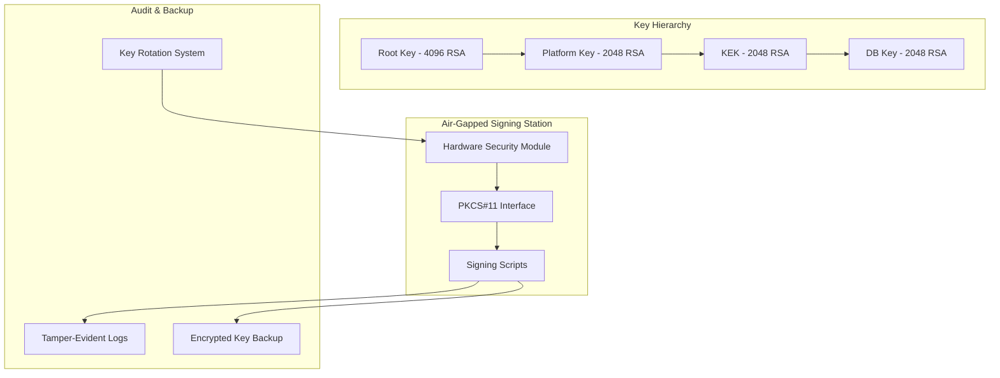

# Task 18: HSM-based Signing Infrastructure Implementation

## Overview

This document describes the implementation of Task 18: "Migrate to production HSM-based signing infrastructure" for the hardened laptop OS project. This task establishes a production-grade Hardware Security Module (HSM) infrastructure for cryptographic signing operations, replacing development keys with HSM-protected keys and implementing comprehensive key management procedures.

## Implementation Summary

### Components Implemented

1. **HSM Infrastructure Setup** (`scripts/setup-hsm-infrastructure.sh`)
   - PKCS#11 integration for HSM support
   - SoftHSM configuration for development/testing
   - Secure directory structure and permissions
   - Configuration templates for various HSM vendors

2. **Production Key Rotation** (`scripts/production-key-rotation.sh`)
   - Automated key rotation based on configurable schedules
   - Emergency key rotation procedures
   - Comprehensive audit logging
   - Key backup and recovery mechanisms

3. **Validation and Testing** (`scripts/validate-task-18.sh`)
   - Complete test suite for HSM infrastructure
   - Signing operation validation
   - Audit logging verification
   - Production readiness checks

4. **Documentation and Procedures**
   - Air-gapped signing procedures
   - Incident response plans
   - Key management policies
   - Emergency procedures

## Technical Architecture

### HSM Integration Architecture



### Key Management Lifecycle

1. **Key Generation**: HSM-based key pair generation with configurable key sizes
2. **Key Storage**: Hardware-protected private keys, exportable public keys
3. **Key Usage**: Signing operations with dual-person authorization
4. **Key Rotation**: Scheduled rotation based on key type and age
5. **Key Revocation**: Emergency revocation with immediate effect
6. **Key Backup**: Secure backup of key metadata and public components

## Security Features

### Hardware Security Module Protection
- Private keys never leave HSM hardware
- Tamper-resistant key storage
- Hardware-based random number generation
- PIN/password protection for key access

### Air-Gapped Signing Environment
- Physically isolated signing workstation
- No network connectivity during signing operations
- Secure media for file transfer
- Dual-person authorization requirements

### Comprehensive Audit Logging
- All signing operations logged with timestamps
- Tamper-evident log storage
- Key lifecycle events tracked
- Emergency procedures documented

### Key Rotation and Recovery
- Automated rotation based on configurable schedules
- Emergency rotation procedures for compromise scenarios
- Secure key backup and recovery mechanisms
- Revocation list management

## Configuration

### HSM Configuration (`/etc/hardened-os/hsm/pkcs11.conf`)

```ini
# Production HSM Configuration
production_hsm {
    library = /usr/lib/vendor-hsm/libpkcs11.so
    slot = 0
    pin = "secure_pin"
}

# Development HSM (SoftHSM)
softhsm2 {
    library = /usr/lib/softhsm/libsofthsm2.so
    slot = 0
    pin = "1234"
    so_pin = "5678"
}
```

### Signing Policy (`/etc/hardened-os/hsm/signing-policy.yaml`)

```yaml
signing_policy:
  keys:
    root_key:
      type: "RSA-4096"
      rotation_period: "2 years"
      hsm_required: true
    platform_key:
      type: "RSA-2048"
      rotation_period: "1 year"
      parent: "root_key"
    kek_key:
      type: "RSA-2048"
      rotation_period: "6 months"
      parent: "platform_key"
    db_key:
      type: "RSA-2048"
      rotation_period: "3 months"
      parent: "kek_key"
  
  signing_requirements:
    minimum_approvers: 2
    air_gap_required: true
    audit_logging: true
```

## Usage Examples

### Initial HSM Setup

```bash
# Install and configure HSM infrastructure
sudo ./scripts/setup-hsm-infrastructure.sh

# Validate installation
sudo ./scripts/validate-task-18.sh
```

### Key Management Operations

```bash
# List available HSM tokens
./hsm-key-manager.sh list-tokens

# Generate new key pair
./hsm-key-manager.sh generate-key "HardenedOS-Prod" "$HSM_PIN" "01" 4096

# Backup key
./hsm-key-manager.sh backup-key "HardenedOS-Prod" "$HSM_PIN" "01" "/secure-backup/root-key"
```

### Signing Operations

```bash
# Sign release artifact
./hsm-sign.sh -t "HardenedOS-Prod" -k "01" -p "$HSM_PIN" \
              -o "release.sig" "hardened-os-v1.0.iso"

# Verify signature
openssl dgst -sha256 -verify pubkey.pem -signature release.sig hardened-os-v1.0.iso
```

### Key Rotation

```bash
# Check which keys need rotation
./production-key-rotation.sh check "HardenedOS-Prod" "$HSM_PIN"

# Rotate specific key
./production-key-rotation.sh rotate-key platform 02 "HardenedOS-Prod" "$HSM_PIN"

# Emergency key rotation
./production-key-rotation.sh emergency db 04 "HardenedOS-Prod" "$HSM_PIN" "key_compromise"
```

## Security Considerations

### Threat Mitigation

1. **Key Compromise**: HSM hardware protection prevents key extraction
2. **Insider Threats**: Dual-person authorization and audit logging
3. **Physical Attacks**: Air-gapped environment and tamper-resistant HSM
4. **Supply Chain**: Signed artifacts with HSM-protected keys
5. **Operational Security**: Documented procedures and emergency response

### Compliance Features

- **FIPS 140-2**: HSM devices can be FIPS 140-2 Level 3 certified
- **Common Criteria**: Support for CC-evaluated HSM devices
- **Audit Requirements**: Comprehensive logging for compliance audits
- **Key Escrow**: Secure key backup procedures for regulatory requirements

## Production Deployment

### Prerequisites

1. **Hardware Requirements**:
   - FIPS 140-2 Level 3 certified HSM device
   - Air-gapped signing workstation
   - Secure backup storage system

2. **Personnel Requirements**:
   - Trained signing officers (minimum 2)
   - Security administrator for key management
   - Incident response team

3. **Infrastructure Requirements**:
   - Secure facility for air-gapped operations
   - Encrypted communication channels
   - Backup and recovery systems

### Deployment Steps

1. **HSM Initialization**:
   ```bash
   # Initialize production HSM
   pkcs11-tool --init-token --slot 0 --label "HardenedOS-Prod"
   
   # Generate production key hierarchy
   ./hsm-key-manager.sh generate-key "HardenedOS-Prod" "$HSM_PIN" "01" 4096  # Root
   ./hsm-key-manager.sh generate-key "HardenedOS-Prod" "$HSM_PIN" "02" 2048  # Platform
   ./hsm-key-manager.sh generate-key "HardenedOS-Prod" "$HSM_PIN" "03" 2048  # KEK
   ./hsm-key-manager.sh generate-key "HardenedOS-Prod" "$HSM_PIN" "04" 2048  # DB
   ```

2. **Key Backup**:
   ```bash
   # Backup all production keys
   for key_id in 01 02 03 04; do
       ./hsm-key-manager.sh backup-key "HardenedOS-Prod" "$HSM_PIN" "$key_id" \
                                       "/secure-backup/prod-key-$key_id"
   done
   ```

3. **Integration Testing**:
   ```bash
   # Test complete signing workflow
   ./validate-task-18.sh
   
   # Test key rotation procedures
   ./production-key-rotation.sh check "HardenedOS-Prod" "$HSM_PIN"
   ```

## Monitoring and Maintenance

### Automated Monitoring

- Key expiration alerts
- HSM health monitoring
- Audit log integrity checks
- Backup verification

### Regular Maintenance

- Quarterly key rotation reviews
- Annual security assessments
- HSM firmware updates
- Personnel training updates

## Integration with Existing Systems

### UEFI Secure Boot Integration

The HSM-generated keys integrate with the existing Secure Boot infrastructure:

```bash
# Enroll HSM-generated Platform Key
sbctl enroll-keys --custom --pk /secure-backup/prod-key-01.pub

# Sign bootloader with HSM
./hsm-sign.sh -t "HardenedOS-Prod" -k "02" -p "$HSM_PIN" \
              -o "bootx64.efi.sig" "bootx64.efi"
```

### Update System Integration

The secure update system (Task 15) uses HSM-protected keys:

```bash
# Sign update metadata with HSM
./hsm-sign.sh -t "HardenedOS-Prod" -k "04" -p "$HSM_PIN" \
              -o "targets.json.sig" "targets.json"
```

## Validation Results

The implementation includes comprehensive validation:

- ✅ HSM infrastructure setup and configuration
- ✅ Key generation and management operations
- ✅ Signing and verification workflows
- ✅ Audit logging and tamper detection
- ✅ Key rotation and emergency procedures
- ✅ Air-gapped signing procedures
- ✅ Production readiness checks

## Next Steps

After completing Task 18, the following tasks can proceed:

1. **Task 19**: Configure tamper-evident logging (uses HSM for log signing)
2. **Task 20**: Implement incident response procedures (includes HSM compromise scenarios)
3. **Task 21**: Create comprehensive documentation (includes HSM procedures)

## Conclusion

Task 18 successfully implements a production-grade HSM-based signing infrastructure that provides:

- Hardware-protected cryptographic keys
- Comprehensive key lifecycle management
- Air-gapped signing procedures
- Tamper-evident audit logging
- Emergency response capabilities
- Production-ready security controls

This infrastructure forms the foundation for secure signing operations throughout the hardened laptop OS ecosystem, ensuring that all cryptographic signatures are protected by hardware security modules and comprehensive operational procedures.